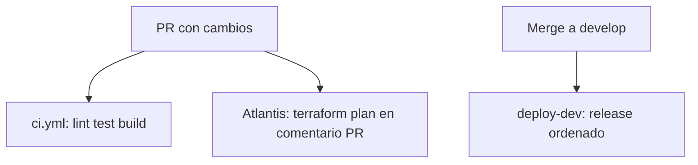

# CI/CD

Pipeline de integración y despliegue continuo sobre GitHub Actions + Atlantis
para IaC, con autenticación OIDC hacia AWS (sin credenciales estáticas).

**Guía completa de despliegue desde cero (bootstrap, dev, staging, prod,
secrets de GitHub, primer apply local):** [`deploy-environments.md`](./deploy-environments.md).

## Modelo de ramas

| Rama         | Rol                            | Al hacer merge                                      |
| ------------ | ------------------------------ | --------------------------------------------------- |
| `develop`    | Integración (rama por defecto) | Deploy apps **dev** + `terraform apply` dev         |
| `production` | Producción                     | Deploy apps **prod** + `terraform apply` prod       |
| `feature/*`  | Trabajo                        | PR → CI + Atlantis plan                             |

## Estructura de workflows

```
.github/
├── actions/setup/action.yml
├── filters/
│   ├── services.yml              # ECS: qué contenedores rebuild/redeploy
│   └── iac.yml                   # Terraform: qué entorno aplicar
└── workflows/
    ├── ci.yml                    # PR: lint, test, build, docker, iac validate
    ├── deploy.yml                # release ordenado (reusable)
    ├── deploy-dev.yml            # único trigger push develop
    ├── deploy-production.yml     # único trigger push production
    ├── iac-apply.yml             # terraform apply (reusable)
    ├── iac-apply-dev.yml         # apply manual de emergencia
    ├── iac-apply-production.yml  # apply manual de emergencia
    ├── db-bootstrap.yml          # migración/bootstrap (reusable)
    ├── db-bootstrap-dev.yml      # ejecución manual
    ├── db-bootstrap-production.yml # ejecución manual
    └── db-reset-dev.yml

atlantis.yaml                     # Plan en PR (servidor Atlantis en ECS)
```

## Flujo completo



| Fase | Herramienta | Cuándo |
| ---- | ----------- | ------ |
| Validación sintaxis `.tf` | CI `iac` job | PR si cambió `iac/**` |
| **Plan** (impacto real) | **Atlantis** | PR: autoplan o `atlantis plan` |
| **Apply** infra | **GitHub Actions** | Dentro del release si cambió IaC o una Lambda |
| Deploy contenedores | GitHub Actions | Dentro del mismo release, después de IaC y DB |

Atlantis tiene `ATLANTIS_DISABLE_APPLY_ALL=true`: rechaza `atlantis apply`. El
apply solo ocurre en GitHub Actions con rol OIDC dedicado y environment
protegido.

## CI (`ci.yml`)

| Job       | Qué hace |
| --------- | -------- |
| `quality` | lint · format · typecheck |
| `test`    | tests unitarios (turbo) |
| `build`   | build (turbo) |
| `changes` | servicios ECS tocados |
| `docker`  | build imagen (sin push) por servicio cambiado |
| `iac`     | `terraform fmt -check` + `validate` si cambió `iac/` |

Tests de integración (testcontainers): `pnpm test:integration` local / manual.

Los tests unitarios no requieren `DATABASE_URL` en GitHub Secrets: `@polaris/database`
inicializa la conexión solo al llamar `createDataSource()`, no al importar el paquete.

## Release de entorno (`deploy.yml`)

`deploy-dev.yml` y `deploy-production.yml` son los únicos workflows AWS con
trigger de push. Ambos llaman al orquestador reusable y comparten el lock
`release-<entorno>` con todas las operaciones manuales.

Orden determinista:

1. lint, typecheck, tests y build;
2. Terraform apply si cambió IaC o `lambdas/**`;
3. migración/bootstrap si cambió la base de datos;
4. build/push de imágenes ECS con tag inmutable `${GITHUB_SHA}`;
5. registro de una nueva task definition y `update-service --task-definition`;
6. estabilidad ECS, comprobación de conteos/rollout/tag SHA y web-admin en prod.

Un cambio IaC redespliega todos los servicios para que ninguna task definition
creada por Terraform quede apuntando a `latest`. Los pasos de fallo muestran
eventos ECS, tasks detenidas y logs recientes de CloudWatch.

## DB bootstrap (`db-bootstrap-dev.yml`, `db-bootstrap-production.yml`)

Task ECS **one-shot** (no servicio permanente) que corre después del primer deploy o cuando
cambia `packages/database/**` o `apps/db-bootstrap/**`.

| Camino | Trigger | Environment GHA |
| ------ | ------- | --------------- |
| `deploy-dev.yml` | push `develop` si cambió DB | `dev` |
| `deploy-production.yml` | push `production` si cambió DB | `prod` |
| wrappers `db-bootstrap-*` | solo manual | `dev` / `prod` |

| Paso | Qué hace |
| ---- | -------- |
| Build/push | Imagen `polaris-<env>-db-bootstrap` en ECR |
| `ecs run-task` | Task Fargate en subnets privadas |
| Script idempotente | Migraciones → si BD vacía: seed + sync Redis + admin Cognito |

**No hace falta secret en GitHub** para la contraseña admin: vive en Secrets Manager
(`polaris-<env>-db-bootstrap-env`, clave `BOOTSTRAP_ADMIN_PASSWORD`). Terraform genera
una contraseña aleatoria si no defines `bootstrap_admin_password` en el `.tfvars`.

El script sale en segundos con *"Bootstrap skipped"* si la BD ya tiene datos y el admin
existe en RDS y Cognito.

**Cuándo corre:** el orquestador lo incluye cuando cambia database/db-bootstrap,
o se puede lanzar manualmente vía `workflow_dispatch`. En prod respeta
**required reviewers**. Siempre corre después de IaC y antes del deploy ECS.

Credenciales admin inicial tras bootstrap:

```bash
# dev
aws secretsmanager get-secret-value \
  --secret-id polaris-dev-db-bootstrap-env \
  --query 'SecretString' --output text | jq -r .BOOTSTRAP_ADMIN_PASSWORD

# prod
aws secretsmanager get-secret-value \
  --secret-id polaris-prod-db-bootstrap-env \
  --query 'SecretString' --output text | jq -r .BOOTSTRAP_ADMIN_PASSWORD
```

Login: `admin@polaris.local` / contraseña del secret anterior.

## DB reset dev (`db-reset-dev.yml`)

**Solo manual** (`workflow_dispatch`). **Destructivo:** vacía tablas de aplicación en
RDS dev, recarga el seed y re-sincroniza Redis (incluye borrar claves legacy `parking:*`).

| Workflow | Trigger | Environment GHA |
| -------- | ------- | ----------------- |
| `db-reset-dev.yml` | Manual; input `confirm` = `reset-dev` | `dev` |

| Paso | Qué hace |
| ---- | -------- |
| Build/push | Imagen `polaris-dev-db-bootstrap` (incluye `dist/reset.js`) |
| `ecs run-task` | `node dist/reset.js` en subnets privadas |
| Script | `TRUNCATE` → seed → flush Redis → `syncParkingRedis` |

**No borra** usuarios de Cognito. Usar tras datos inconsistentes (p. ej. reservas
parciales por CROSSSLOT) antes de probar de nuevo mobile/web.

**Cómo lanzarlo:** GitHub → Actions → **DB reset dev** → Run workflow → escribe
`reset-dev` en el campo de confirmación.

Alternativa local: `pnpm db:reset:dev` (misma task ECS vía script).

## IaC — Atlantis (plan)

Servidor en ECS (`iac/modules/atlantis`, opcional con `enable_atlantis = true`):

- ALB público HTTPS + certificado ACM.
- Webhook de GitHub → `https://<atlantis-domain>/events`.
- Task role: `ReadOnlyAccess` + RW en bucket de state (locks).
- Variables de entorno: `TF_STATE_BUCKET`, `TF_STATE_KEY`, `AWS_DEFAULT_REGION`.
- Workflow en `atlantis.yaml`: `terraform init` + `plan` con `dev.ci.tfvars`.

En el PR verás el plan como comentario. Revisa creates/changes/destroys antes del merge.

## IaC — GitHub Actions (apply)

El orquestador llama a `iac-apply.yml` cuando detecta cambios en IaC o Lambdas:

1. Asume rol `AWS_TERRAFORM_APPLY_ROLE_ARN` (OIDC).
2. `pnpm build:lambdas` — Terraform empaqueta `lambdas/*/dist`.
3. `terraform init`, `fmt -check` y `validate`.
4. `terraform apply -auto-approve` con el `*.ci.tfvars` del entorno.

Los wrappers `iac-apply-dev.yml` e `iac-apply-production.yml` quedan disponibles
solo para dispatch manual y usan el mismo lock que el release.

## OIDC — tres roles

| Rol IAM | Módulo | Uso |
| ------- | ------ | --- |
| `polaris-<env>-github-deploy` | `github-oidc` | CD apps: ECR + ECS |
| `polaris-<env>-github-terraform-apply` | `github-terraform` | GHA: `terraform apply` |
| `polaris-<env>-atlantis-task` | `atlantis` (task role) | Atlantis: `terraform plan` |

Todos exigen `sub = repo:jeancdevx/polaris:environment:<env>` salvo Atlantis
(task role ECS, no OIDC).

---

## Checklist: GitHub Environments (configurar una vez)

Crea dos environments en **Settings → Environments**: `dev` y `prod`.

### Environment `dev`

| Tipo | Nombre | Valor |
| ---- | ------ | ----- |
| **Secret** | `AWS_DEPLOY_ROLE_ARN` | `terraform output -raw github_deploy_role_arn` |
| **Secret** | `AWS_TERRAFORM_APPLY_ROLE_ARN` | `terraform output -raw github_terraform_apply_role_arn` |
| **Variable** | `AWS_REGION` | `us-east-2` |
| **Variable** | `TF_STATE_BUCKET` | `terraform output -raw state_bucket_name` (desde `iac/bootstrap`) |
| **Variable** | `TF_STATE_KEY` | `env/dev/terraform.tfstate` (opcional; el workflow ya lo fija) |

Opcional en `dev`: sin required reviewers (deploy rápido de integración).

### Environment `prod` (Fase 9)

| Tipo | Nombre | Valor |
| ---- | ------ | ----- |
| **Secret** | `AWS_DEPLOY_ROLE_ARN` | ARN rol prod (mismo output, entorno prod) |
| **Secret** | `AWS_TERRAFORM_APPLY_ROLE_ARN` | ARN rol terraform apply prod |
| **Variable** | `AWS_REGION` | región prod |
| **Variable** | `TF_STATE_BUCKET` | bucket state prod |

**Obligatorio en prod:**

- **Required reviewers** (tú o el equipo) antes de cada deploy/apply.
- **Deployment branches**: solo `production`.

### Lo que NO va en GitHub Secrets

| Dato | Dónde vive |
| ---- | ---------- |
| `aws_profile` (SSO local) | Solo en `dev.tfvars` gitignored |
| `atlantis_github_token` | AWS Secrets Manager (`polaris-dev-atlantis`) vía Terraform |
| `atlantis_webhook_secret` | Output Terraform / Secrets Manager |
| Credenciales AWS estáticas | No se usan |

---

## Bootstrap ordenado (primera vez)

### 1. State bucket (local, una vez)

```bash
cd iac/bootstrap
cp terraform.tfvars.example terraform.tfvars
terraform init && terraform apply
export TF_STATE_BUCKET=$(terraform output -raw state_bucket_name)
```

### 2. Dev infra + roles OIDC (local, una vez)

```bash
cd iac/environments/dev
cp dev.tfvars.example dev.tfvars
cp backend.hcl.example backend.hcl   # bucket = $TF_STATE_BUCKET
# Editar dev.tfvars: aws_profile, terraform_state_bucket

terraform init -backend-config=backend.hcl
terraform apply -var-file=dev.tfvars
```

Copiar outputs a GitHub environment `dev` (tabla arriba).

Actualizar `iac/environments/dev/dev.ci.tfvars`:

```hcl
terraform_state_bucket = "<tu-bucket-real>"
```

### 3. Habilitar Atlantis (cuando tengas dominio + cert ACM)

En `dev.tfvars` (local, no commitear el token):

```hcl
enable_atlantis            = true
atlantis_domain_name       = "atlantis.tu-dominio.com"
atlantis_acm_certificate_arn = "arn:aws:acm:..."
# atlantis_github_token → mejor export TF_VAR_atlantis_github_token=ghp_...
```

```bash
terraform apply -var-file=dev.tfvars
```

Luego:

1. DNS `CNAME` `atlantis.tu-dominio.com` → `terraform output -raw atlantis_alb_dns_name`
2. GitHub → repo → Settings → Webhooks → Add:
   - URL: `terraform output -raw atlantis_webhook_url`
   - Secret: `terraform output -raw atlantis_webhook_secret` (sensible)
   - Events: Pull requests, Issue comments, Push (opcional)
3. Crear usuario/bot GitHub `polaris-atlantis` con PAT `repo` scope (el que pusiste en `atlantis_github_token`)

### 4. Flujo día a día

1. PR con cambios en `iac/` → Atlantis autoplan (o comenta `atlantis plan`).
2. Revisas el plan en el comentario del PR.
3. Merge a `develop` → `deploy-dev.yml` valida y ejecuta en serie IaC → DB → ECS → health.
4. Los pasos sin cambios se omiten; nunca hay applies/deploys paralelos del mismo entorno.

---

## Archivos de configuración Terraform

| Archivo | En git | Uso |
| ------- | ------ | --- |
| `dev.tfvars.example` | ✅ | Plantilla local |
| `dev.tfvars` | ❌ | Local: `aws_profile`, tokens Atlantis |
| `dev.ci.tfvars` | ✅ | CI/Atlantis/GHA: sin profile |
| `backend.hcl.example` | ✅ | Plantilla backend |
| `backend.hcl` | ❌ | Local: bucket real |

GHA y Atlantis **no** usan `backend.hcl` ni `aws_profile`; inyectan bucket/key
por env vars / workflow.

## Agregar un servicio ECS al pipeline

Ver sección anterior en `.github/filters/services.yml` + `ALL_SERVICES` en `deploy.yml`.

## Agregar un entorno Terraform (p. ej. prod completo)

1. `iac/environments/prod/` con `prod.ci.tfvars` y state key `env/prod/terraform.tfstate`.
2. Proyecto en `atlantis.yaml` con workflow propio.
3. Módulos `github-oidc` + `github-terraform` en prod.
4. GitHub environment `prod` con secrets/vars y required reviewers.
