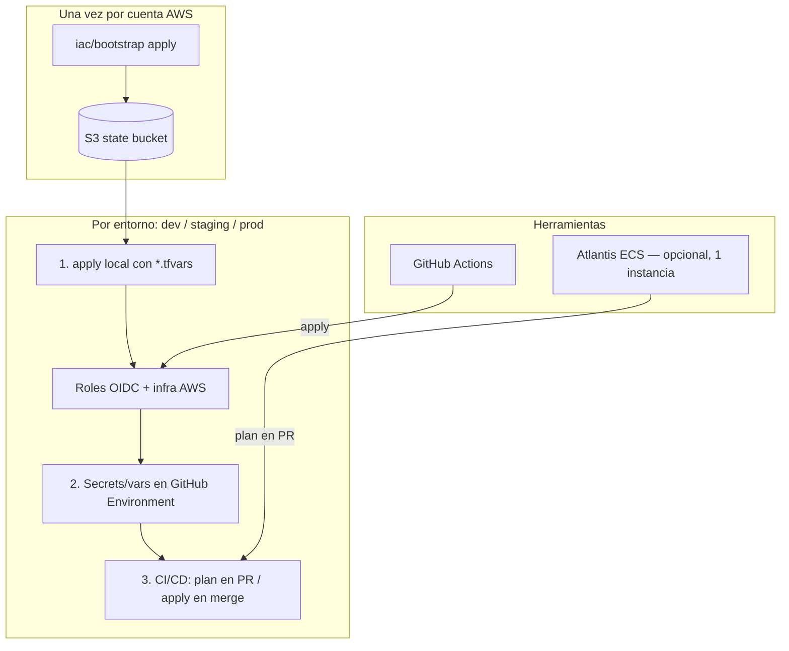

# Despliegue de entornos desde cero

Guía paso a paso para provisionar **bootstrap**, **dev**, **staging** y **prod** en
AWS, y conectar **GitHub Actions** + **Atlantis** sin credenciales estáticas.

Complementa [`ci-cd.md`](./ci-cd.md) (referencia rápida de workflows).

---

## El problema del huevo y la gallina

GitHub Actions aplica Terraform con **OIDC**: asume un rol IAM que **solo existe
después del primer `terraform apply`** del entorno.

```
Sin apply local  →  no hay roles OIDC  →  CI/CD no puede aplicar nada
Primer apply     →  crea VPC, ECS, roles OIDC, ECR, etc.
Segundo paso     →  configuras secrets en GitHub  →  CI/CD ya funciona
```

**Conclusión:** el **primer apply de cada entorno** debe hacerse **en local**
(con `aws_profile` / SSO). A partir de ahí, los merges a `develop` o
`production` pueden aplicar vía GHA.

Lo mismo aplica a **deploy de apps** (ECR/ECS): el rol `github-deploy` también
nace en ese primer apply.

---

## Vista general



| Capa | Herramienta | Qué hace |
| ---- | ----------- | -------- |
| State | `iac/bootstrap` | Bucket S3 + locks para todos los entornos |
| Infra | Terraform por entorno | VPC, MSK, RDS, ECS, edge, etc. |
| Plan en PR | Atlantis (opcional) | `terraform plan` comentado en el PR |
| Apply | GitHub Actions | `terraform apply` con rol OIDC |
| Apps | GitHub Actions | build → ECR → `ecs update-service` |

---

## Estrategia de coste recomendada

No es obligatorio tener **dev + staging + prod** vivos a la vez.

| Entorno | ¿Cuándo tenerlo en AWS? | Coste |
| ------- | ------------------------ | ----- |
| **Local** (`docker-compose`) | Siempre — desarrollo diario | $0 en AWS |
| **Dev AWS** | Solo si necesitas probar MSK/Cognito/AppSync reales en la nube | Alto |
| **Staging** | Ventanas cortas antes de un release; luego `destroy` | Alto |
| **Prod** | El único stack permanente recomendado para cuenta pequeña | Alto |

Los directorios `iac/environments/*` son **plantillas**. Puedes tener solo
`env/prod/terraform.tfstate` con recursos activos.

**Atlantis:** una sola instancia (p. ej. en prod) planea los tres proyectos
definidos en `atlantis.yaml`.

---

## Fase 0 — Bootstrap (una vez por cuenta AWS)

Crea el bucket de state compartido por todos los entornos.

### Prerrequisitos

- AWS CLI + credenciales con permisos de administrador (solo para bootstrap y
  primeros applies).
- Terraform ≥ 1.15.
- Repo clonado.

### Pasos

```bash
cd iac/bootstrap
cp terraform.tfvars.example terraform.tfvars
# Editar: aws_profile, project_name, aws_region

terraform init
terraform plan
terraform apply
```

### Outputs importantes

```bash
terraform output -raw state_bucket_name
# Ej: polaris-bootstrap-tfstate-737710549633-us-east-2
```

Guarda ese nombre: lo usarás en `backend.hcl`, `*.ci.tfvars` y GitHub variable
`TF_STATE_BUCKET`.

**No hay OIDC ni GitHub en esta fase** — solo el bucket.

---

## Archivos de configuración Terraform

Cada entorno (`iac/environments/<env>/`) usa:

| Archivo | ¿En git? | Quién lo usa | Contenido típico |
| ------- | -------- | ------------ | ---------------- |
| `<env>.tfvars.example` | ✅ | Plantilla | Documentación |
| `<env>.tfvars` | ❌ gitignore | **Apply local** | `aws_profile`, tokens sensibles |
| `<env>.ci.tfvars` | ✅ | **GHA + Atlantis** | Sin profile; bucket real; flags de infra |
| `backend.hcl.example` | ✅ | Plantilla | |
| `backend.hcl` | ❌ gitignore | **Init local** | `bucket`, `key`, `region` |

### Regla de oro: `*.ci.tfvars` vs `*.tfvars`

| Pregunta | Respuesta |
| -------- | --------- |
| ¿Qué manda para CI? | **Solo** `<env>.ci.tfvars` |
| ¿Qué pasa si local pone `enable_atlantis = true` y CI tiene `false`? | El próximo apply de CI **destruye** Atlantis |
| ¿Cómo evitar sorpresas? | Mismos valores en flags críticos en **ambos** archivos |
| ¿Dónde va el token de Atlantis? | `TF_VAR_atlantis_github_token` (nunca en git) |

Variables con **default** en `variables.tf` (p. ej. `enable_atlantis = false`)
valen igual si no las pones en `prod.tfvars`. Líneas **comentadas** no cuentan.

---

## Fase 1 — Entorno **local** (sin AWS)

No usa Terraform de entorno. Es el día a día de desarrollo.

```bash
docker compose -f infra/local/docker-compose.yml up -d
pnpm install && pnpm build
pnpm dev --filter api-service   # etc.
```

Cuando necesites Cognito/AppSync/MSK reales, pasas a dev AWS o prod — no hace
falta para escribir código.

---

## Fase 2 — Entorno **dev** en AWS (opcional)

Root: `iac/environments/dev/`  
State key: `env/dev/terraform.tfstate`  
Rama CI: `develop` → `iac-apply-dev.yml` + `deploy-dev.yml`

### 2.1 Primer apply (local, obligatorio)

```bash
# Compilar Lambdas (Terraform empaqueta lambdas/*/dist)
pnpm turbo run build --filter='./lambdas/*'

cd iac/environments/dev
cp dev.tfvars.example dev.tfvars
cp backend.hcl.example backend.hcl
```

Editar **`dev.tfvars`**:

```hcl
aws_profile            = "tu-perfil-sso"
terraform_state_bucket = "polaris-bootstrap-tfstate-XXXX-us-east-2"
# ... resto según dev.tfvars.example
```

Editar **`backend.hcl`**:

```hcl
bucket = "polaris-bootstrap-tfstate-XXXX-us-east-2"
key    = "env/dev/terraform.tfstate"
region = "us-east-2"
```

Commit **`dev.ci.tfvars`** con el bucket real (sin `aws_profile`):

```hcl
terraform_state_bucket = "polaris-bootstrap-tfstate-XXXX-us-east-2"
github_repository      = "tu-org/polaris"
```

```bash
terraform init -backend-config=backend.hcl
terraform plan -var-file=dev.tfvars
terraform apply -var-file=dev.tfvars   # 30–60 min la primera vez
```

### 2.2 Configurar GitHub Environment `dev`

**Settings → Environments → New environment → `dev`**

| Tipo | Nombre | Valor |
| ---- | ------ | ----- |
| **Secret** | `AWS_DEPLOY_ROLE_ARN` | Ver abajo |
| **Secret** | `AWS_TERRAFORM_APPLY_ROLE_ARN` | Ver abajo |
| **Variable** | `AWS_REGION` | `us-east-2` |
| **Variable** | `TF_STATE_BUCKET` | Nombre del bucket bootstrap |

Obtener ARNs tras el apply:

```bash
cd iac/environments/dev
terraform output -raw github_deploy_role_arn
terraform output -raw github_terraform_apply_role_arn
```

**Opcional en dev:** sin required reviewers (deploy rápido).

**Deployment branches:** `develop` (o todas, según prefieras).

El rol OIDC solo acepta jobs con
`sub = repo:<owner>/<repo>:environment:dev`. El nombre del environment en GitHub
**debe** ser exactamente `dev`.

### 2.3 Post-apply dev

1. **Imágenes Docker** (Terraform no hace push):

   ```bash
   pnpm docker:push:api-service:dev
   pnpm docker:push:reservation-service:dev
   # ... resto de servicios
   ```

2. **DB bootstrap** — workflow `db-bootstrap-dev.yml` en push a `develop`, o
   manual. Credencial admin inicial:

   ```bash
   aws secretsmanager get-secret-value \
     --secret-id polaris-dev-db-bootstrap-env \
     --query 'SecretString' --output text | jq -r .BOOTSTRAP_ADMIN_PASSWORD
   ```

3. **Verificar** — outputs `api_gateway_endpoint`, smoke tests del README de
   dev.

### 2.4 Flujo día a día (dev)

1. PR → `ci.yml` (lint/test) + Atlantis plan (si está habilitado).
2. Merge a `develop` con cambios en `iac/**` → `iac-apply-dev.yml`.
3. Merge con cambios en apps → `deploy-dev.yml`.

### 2.5 Clientes locales contra APIs en AWS (dev)

En **dev** no hay módulo `edge` (sin CloudFront para web-admin). La UI y el móvil
corren en tu máquina, pero pueden usar backends reales en AWS:

| Cliente | Comando | Qué apunta a AWS |
| ------- | ------- | ---------------- |
| **web-admin** | `pnpm web-admin:env:dev` + `pnpm --filter web-admin dev` | Admin API (`execute-api`), AppSync, Cognito |
| **mobile** | `pnpm mobile:env:dev` + `pnpm --filter mobile dev` | API pública (`execute-api`) |

```bash
pnpm web-admin:env:dev   # genera apps/web-admin/.env.local desde outputs Terraform
pnpm --filter web-admin dev   # http://localhost:3000
```

El API Gateway admin en dev tiene CORS para `http://localhost:3000`, así que el
browser llama directo a `NEXT_PUBLIC_ADMIN_API_URL` (sin BFF en local).

**Qué no pruebas en local:** el deploy estático S3 + CloudFront de web-admin. Eso
solo existe en **staging** y **prod** (módulo `edge`).

---

## Fase 3 — Entorno **staging** (opcional)

Root: `iac/environments/staging/`  
State key: `env/staging/terraform.tfstate`  
Dominios: `staging-api.galaxymorph.com`, etc. (módulo `edge`)

### Diferencias con dev

- RDS/Redis **provisioned** (ver `staging.tfvars.example`).
- Módulo **edge** activo (CloudFront, WAF, Route53).
- API admin: `disable_execute_api_endpoint = true` (solo CloudFront).
- `base_domain` + `hosted_zone_id` obligatorios.

### 3.1 Primer apply (solo local hoy)

**No hay workflow `iac-apply-staging.yml`** — el apply es manual o vía
`workflow_dispatch` futuro.

```bash
pnpm turbo run build --filter='./lambdas/*'

cd iac/environments/staging
cp staging.tfvars.example staging.tfvars
cp backend.hcl.example backend.hcl
# Editar: aws_profile, terraform_state_bucket, base_domain, hosted_zone_id

terraform init -backend-config=backend.hcl
terraform apply -var-file=staging.tfvars
```

Actualizar **`staging.ci.tfvars`** con el bucket real (para Atlantis plan).

### 3.2 GitHub Environment `staging` (si usarás CI después)

Misma tabla que dev/prod, con environment name **`staging`** y ARNs del apply de
staging:

```bash
terraform output -raw github_deploy_role_arn
terraform output -raw github_terraform_apply_role_arn
```

Atlantis puede planear staging (`atlantis plan -p staging`) si el servidor está
corriendo.

### 3.3 Post-apply staging

1. Push imágenes ECR con tag `staging` (o el que definas).
2. Migraciones/seed — ejecutar task `db-bootstrap` manualmente en ECS (no hay
   workflow automático aún).
3. Deploy web-admin — workflow **`deploy-web-admin-staging.yml`** (manual,
   `workflow_dispatch`) tras configurar variables en GitHub environment `staging`.
4. Verificar URLs:

   ```bash
   terraform output api_public_url
   terraform output admin_api_public_url
   terraform output admin_public_url
   ```

---

## Fase 4 — Entorno **prod** (recomendado como único permanente)

Root: `iac/environments/prod/`  
State key: `env/prod/terraform.tfstate`  
Rama CI: `production` → `iac-apply-production.yml` + `deploy-production.yml`

### 4.1 Primer apply (local, obligatorio)

```bash
pnpm turbo run build --filter='./lambdas/*'

cd iac/environments/prod
cp prod.tfvars.example prod.tfvars
cp backend.hcl.example backend.hcl
```

**`prod.tfvars`** (local):

```hcl
aws_profile            = "default"
terraform_state_bucket = "polaris-bootstrap-tfstate-XXXX-us-east-2"
base_domain            = "galaxymorph.com"
hosted_zone_id         = "Z0437101YIMTM4WCJEKJ"
# enable_atlantis = false  ← dejar así en el primer apply
```

**`backend.hcl`:**

```hcl
bucket = "polaris-bootstrap-tfstate-XXXX-us-east-2"
key    = "env/prod/terraform.tfstate"
region = "us-east-2"
```

**`prod.ci.tfvars`** (commiteado) — debe reflejar los mismos flags que local:

```hcl
terraform_state_bucket = "polaris-bootstrap-tfstate-XXXX-us-east-2"
base_domain            = "galaxymorph.com"
hosted_zone_id         = "Z0437101YIMTM4WCJEKJ"
enable_atlantis        = false
github_repository    = "tu-org/polaris"
```

```bash
terraform init -backend-config=backend.hcl
terraform plan -var-file=prod.tfvars    # revisar ~100+ recursos
terraform apply -var-file=prod.tfvars   # puede tardar >1 h (MSK, RDS, edge…)
```

El apply crea, entre otros:

- VPC, NAT (uno por AZ en prod), MSK, Aurora, Redis, ECS, Lambdas
- Módulos `github-oidc` + `github-terraform` → roles para GHA
- Módulo `edge` → certificados ACM, CloudFront, registros Route53
- Cognito, AppSync con dominios custom

**Notas edge (prod):**

- WAF solo en CloudFront; HTTP API v2 no soporta WAF regional en el stage.
- Cognito custom domain requiere registro A en el apex (`galaxymorph.com`); el
  módulo edge lo crea apuntando a web-admin CloudFront cuando
  `enable_cognito_custom_domain = true`.
- API pública y admin con `disable_execute_api_endpoint = true` (solo entran por
  `api.*` / `admin-api.*`).

**OIDC provider:** el módulo `github-oidc` lo crea en el **primer entorno** que
apliques en la cuenta. Si ya existía por dev, en prod usa
`create_oidc_provider = false` en `github-terraform` (ya está así en el repo).

### 4.2 Configurar GitHub Environment `prod`

**Settings → Environments → `prod`**

| Tipo | Nombre | Valor |
| ---- | ------ | ----- |
| **Secret** | `AWS_DEPLOY_ROLE_ARN` | `terraform output -raw github_deploy_role_arn` |
| **Secret** | `AWS_TERRAFORM_APPLY_ROLE_ARN` | `terraform output -raw github_terraform_apply_role_arn` |
| **Variable** | `AWS_REGION` | `us-east-2` |
| **Variable** | `TF_STATE_BUCKET` | bucket bootstrap |

**Obligatorio en prod:**

- **Required reviewers** (tú o el equipo).
- **Deployment branches:** solo `production`.

### 4.3 Post-apply prod

| Paso | Acción |
| ---- | ------ |
| 1 | Push imágenes a ECR (`polaris-prod-*`) |
| 2 | `ecs update-service --force-new-deployment` o merge a `production` con `deploy-production.yml` |
| 3 | DB: `db-bootstrap-production.yml` (push a `production` con cambios en database, o `workflow_dispatch`) |
| 4 | Web-admin: merge a `production` con cambios en `apps/web-admin/**` → `deploy-web-admin-production.yml` (o `workflow_dispatch`) |
| 5 | Probar URLs públicas (outputs `api_public_url`, `admin_public_url`, etc.) |
| 6 | Configurar clientes (mobile `EXPO_PUBLIC_API_URL`, web-admin env) |

### 4.4 Flujo día a día (prod)

1. PR → CI + Atlantis `atlantis plan -p prod`.
2. Merge a `production` + cambio en `iac/**` → `iac-apply-production.yml`
   (con approval si configuraste reviewers).
3. Cambios en apps → `deploy-production.yml`.
4. Cambios en `packages/database/**` o `apps/db-bootstrap/**` →
   `db-bootstrap-production.yml` (con approval en environment `prod`).
5. Cambios en `apps/web-admin/**` → `deploy-web-admin-production.yml`.

---

## Promoción de cambios: develop → staging → production

Modelo de ramas del repo (ver [`ci-cd.md`](./ci-cd.md)):

| Rama | Entorno AWS | Deploy automático (apps) | IaC apply automático | Web-admin CloudFront |
| ---- | ----------- | ------------------------ | -------------------- | -------------------- |
| `develop` | **dev** | `deploy-dev.yml` | `iac-apply-dev.yml` | ❌ (UI en local) |
| — | **staging** | manual | manual (sin workflow aún) | `deploy-web-admin-staging.yml` (manual) |
| `production` | **prod** | `deploy-production.yml` | `iac-apply-production.yml` | `deploy-web-admin-production.yml` |

### Flujo recomendado

```text
feature/*  →  PR  →  develop  →  (validar en dev AWS + UI local)  →  staging  →  production
```

1. **Un solo camino de integración:** todo entra por PR a `develop`. No commitees
   directo a `production`.
2. **Validar en dev:** merge a `develop` despliega microservicios en dev AWS.
   Prueba web (`localhost:3000`) y móvil contra APIs dev.
3. **Pre-prod en staging (opcional):** cuando dev esté OK, `terraform apply` en
   staging + workflow manual de web-admin staging. Staging replica prod (edge,
   dominios `staging-*`, sizing parecido).
4. **Promover a prod:** merge `develop` → `production` (PR). Prod recibe el
   **mismo código** ya validado, no parches sueltos en prod.
5. **Evitar commits atrasados o de más:**
   - Antes del merge a `production`, la rama `production` debe incluir todo lo de
     `develop` (`git merge develop` en la PR o merge directo develop → production).
   - Resuelve conflictos en la PR, no en prod a mano.
   - No uses cherry-pick aislado hacia `production` salvo hotfixes documentados;
     después del hotfix, mergea `production` de vuelta a `develop` para no
     diverger.
6. **Orden cuando cambian infra + apps + web:**
   1. Merge IaC → `terraform apply` del entorno destino.
   2. Deploy ECS (`deploy-*.yml`).
   3. DB bootstrap si hubo cambios en schema/seed.
   4. Deploy web-admin (build con URLs de **ese** entorno).

### Staging sin rama CI (estado actual)

Hoy **staging no tiene** `iac-apply-staging.yml` ni `deploy-staging.yml`. Opciones:

| Enfoque | Cuándo usarlo |
| ------- | ------------- |
| **A — Manual** | Apply Terraform staging local + workflows manuales; merge a `production` solo cuando staging esté validado |
| **B — Rama `staging`** | Crear rama + workflows espejo de prod (futuro) para promoción automática intermedia |

Para una cuenta pequeña, **A** suele bastar: dev AWS + UI local para el día a día,
staging solo en ventanas pre-release, prod como único permanente.

---

## Web-admin: deploy estático (staging / prod)

La UI en **staging** y **prod** se sirve desde **CloudFront + S3** (módulo
`edge`, prefix `web-admin/` en el bucket assets). El build usa `output: 'export'`;
las llamadas REST van directo al API Gateway admin desde el browser
(`NEXT_PUBLIC_ADMIN_API_URL`).

| Workflow | Environment GitHub | Cuándo |
| -------- | ------------------ | ------ |
| `deploy-web-admin-staging.yml` | `staging` | Manual (`workflow_dispatch`) |
| `deploy-web-admin-production.yml` | `prod` | Push a `production` (cambios en `apps/web-admin/**`) + manual |

**No hay** workflow de web-admin para dev: en dev usas `pnpm --filter web-admin dev`.

---

## Atlantis (opcional, una instancia)

Atlantis **no aplica** cambios (`ATLANTIS_DISABLE_APPLY_ALL=true`). Solo plan en
PR.

### Orden recomendado

1. Tener **prod** (o dev) ya aplicado **sin** Atlantis.
2. Certificado **ACM regional** (us-east-2) para el hostname del ALB de Atlantis.
3. Habilitar en **`prod.ci.tfvars` y `prod.tfvars`** (mismo valor):

   ```hcl
   enable_atlantis              = true
   atlantis_domain_name         = "atlantis-internal.galaxymorph.com"
   atlantis_acm_certificate_arn = "arn:aws:acm:us-east-2:...:certificate/..."
   ```

4. Token **fuera** del archivo:

   ```bash
   export TF_VAR_atlantis_github_token="ghp_..."
   terraform apply -var-file=prod.tfvars
   ```

5. Para que CI no rompa Atlantis, añade en GitHub environment `prod`:

   | Secret | Valor |
   | ------ | ----- |
   | `TF_VAR_atlantis_github_token` | mismo PAT (solo si `enable_atlantis = true` en CI) |

   O extiende `iac-apply.yml` para pasar el secret. Sin token, el `validation`
   de Terraform falla cuando `enable_atlantis = true`.

6. **Webhook** GitHub → URL pública vía edge:

   - URL: `https://atlantis.galaxymorph.com/events`
   - Secret: `terraform output -raw atlantis_webhook_secret`

7. Usuario/bot GitHub con PAT `repo` (p. ej. `polaris-atlantis`).

8. Variables de entorno en la task Atlantis (Terraform las setea): `TF_STATE_BUCKET`,
   `TF_STATE_KEY` — el servidor usa `dev.ci.tfvars` / `prod.ci.tfvars` según
   proyecto en `atlantis.yaml`.

### Planear un entorno desde PR

```text
atlantis plan -p dev
atlantis plan -p staging
atlantis plan -p prod
```

---

## Resumen: secrets y variables en GitHub

Por cada **GitHub Environment** (`dev`, `staging`, `prod`) que uses:

### Secrets (obligatorios para CI/CD)

| Secret | Origen | Usado por |
| ------ | ------ | --------- |
| `AWS_DEPLOY_ROLE_ARN` | `terraform output github_deploy_role_arn` | `deploy-*.yml` |
| `AWS_TERRAFORM_APPLY_ROLE_ARN` | `terraform output github_terraform_apply_role_arn` | `iac-apply-*.yml` |
| `TF_VAR_atlantis_github_token` | PAT GitHub bot | Solo si `enable_atlantis = true` en CI |

### Variables (recomendadas)

| Variable | Valor típico | Usado por |
| -------- | ------------ | --------- |
| `AWS_REGION` | `us-east-2` | Todos los workflows AWS |
| `TF_STATE_BUCKET` | output bootstrap `state_bucket_name` | Init Terraform en GHA |

### Variables web-admin (solo `staging` y `prod`)

Configura en **Settings → Environments → staging / prod → Variables** (no son
secrets: van al bundle del browser o son IDs de infra).

| Variable | Origen (Terraform del entorno) | Usado por |
| -------- | ------------------------------ | --------- |
| `NEXT_PUBLIC_ADMIN_API_URL` | `terraform output -raw admin_api_public_url` | `deploy-web-admin.yml` |
| `NEXT_PUBLIC_APPSYNC_GRAPHQL_ENDPOINT` | `terraform output -raw graphql_public_url` | idem |
| `NEXT_PUBLIC_COGNITO_USER_POOL_ID` | `terraform output -raw cognito_user_pool_id` | idem |
| `NEXT_PUBLIC_COGNITO_CLIENT_ID` | `terraform output -raw cognito_app_client_id` | idem |
| `WEB_CLOUDFRONT_DISTRIBUTION_ID` | `terraform output -raw web_cloudfront_distribution_id` | invalidación CloudFront |
| `WEB_ADMIN_S3_BUCKET` | opcional; default `polaris-assets-{env}-{account}` | sync S3 |

**Secrets vs variables:** los `NEXT_PUBLIC_*` son **variables** (públicas en el
build estático). Solo credenciales sensibles van en **secrets** (p. ej.
`AWS_DEPLOY_ROLE_ARN`). No pongas URLs ni IDs de CloudFront en secrets salvo que
quieras ocultarlos en logs (no aporta seguridad real para URLs públicas).

Deploy manual local (solo si ya tienes credenciales AWS y el entorno aplicado):

```bash
export NEXT_PUBLIC_ADMIN_API_URL="https://staging-admin-api.galaxymorph.com"
export NEXT_PUBLIC_APPSYNC_GRAPHQL_ENDPOINT="https://staging-graphql.galaxymorph.com/graphql"
# ... resto de NEXT_PUBLIC_* y WEB_CLOUDFRONT_DISTRIBUTION_ID
bash scripts/deploy-web-admin.sh staging   # o prod
```

### Lo que NO va en GitHub

| Dato | Dónde |
| ---- | ----- |
| `aws_profile` | Solo `*.tfvars` local |
| Contraseñas RDS / ECS | Secrets Manager (Terraform) |
| `atlantis_webhook_secret` | Output Terraform / Secrets Manager |
| Access keys AWS estáticas | No se usan |

---

## Orden completo recomendado (solo prod en AWS)

Para minimizar coste en una cuenta personal:

```text
1. iac/bootstrap apply
2. iac/environments/prod — primer apply local
3. GitHub environment prod — secrets + variables
4. prod.ci.tfvars — bucket y flags alineados con prod.tfvars
5. Push imágenes ECR + db-bootstrap + assets web-admin
6. (Opcional) Habilitar Atlantis en prod
7. (Opcional) terraform destroy en dev AWS si existía
8. Día a día: PR → plan → merge production → GHA apply/deploy
```

Si además quieres **dev AWS**:

```text
bootstrap → dev apply local → GitHub dev → usar develop
Cuando prod esté listo → destroy dev o dejarlo apagado (desired_count = 0 no
basta para MSK/RDS; hace falta destroy del stack)
```

---

## Checklist por entorno

### Bootstrap

- [ ] `terraform apply` en `iac/bootstrap`
- [ ] Anotar `state_bucket_name`

### Dev (opcional)

- [ ] `pnpm build` lambdas
- [ ] `dev.tfvars` + `backend.hcl`
- [ ] `dev.ci.tfvars` con bucket real
- [ ] `terraform apply` local
- [ ] GitHub environment `dev` con 2 secrets + 2 variables
- [ ] Docker push + db-bootstrap

### Staging (opcional)

- [ ] Igual que prod pero `staging.tfvars` + key `env/staging/...`
- [ ] Apply solo local (sin workflow apply automático)
- [ ] GitHub environment `staging` con secrets + variables (incl. web-admin)
- [ ] Workflow `deploy-web-admin-staging.yml` probado (manual)

### Prod

- [ ] `prod.tfvars` + `backend.hcl`
- [ ] `prod.ci.tfvars` alineado (mismos flags que local)
- [ ] `terraform apply` local
- [ ] GitHub environment `prod` + reviewers + branch `production`
- [ ] Variables web-admin en environment `prod`
- [ ] Docker push + db-bootstrap + deploy web-admin (`deploy-web-admin-production.yml`)
- [ ] Probar URLs edge
- [ ] (Opcional) Atlantis + webhook

---

## Troubleshooting

| Síntoma | Causa probable | Solución |
| ------- | -------------- | -------- |
| GHA: `Could not assume role` | Primer apply no hecho o environment name incorrecto | Apply local; GitHub environment debe ser `dev`/`prod` exacto |
| GHA: `AccessDenied` en state | `TF_STATE_BUCKET` mal o rol sin permiso S3 | Revisar variable y policy del rol terraform-apply |
| Atlantis destruido tras merge | `enable_atlantis` distinto en CI vs lo aplicado antes | Igualar `prod.ci.tfvars` y `prod.tfvars` |
| `terraform apply` falla en Lambda zip | Falta `lambdas/*/dist` | `pnpm turbo run build --filter='./lambdas/*'` |
| Certificados ACM pending | DNS validación no creada | Edge crea records en Route53; esperar validación |
| Plan CI destruye recursos | `*.ci.tfvars` con sizing distinto | Revisar diff; alinear tfvars |

---

## Referencias

- [`docs/ci-cd.md`](./ci-cd.md) — workflows y modelo de ramas
- [`iac/environments/dev/README.md`](../iac/environments/dev/README.md) — módulos y smoke tests dev
- [`iac/environments/prod/README.md`](../iac/environments/prod/README.md) — URLs prod
- [`iac/modules/edge/README.md`](../iac/modules/edge/README.md) — dominios y WAF
- [`atlantis.yaml`](../atlantis.yaml) — proyectos Terraform por entorno
